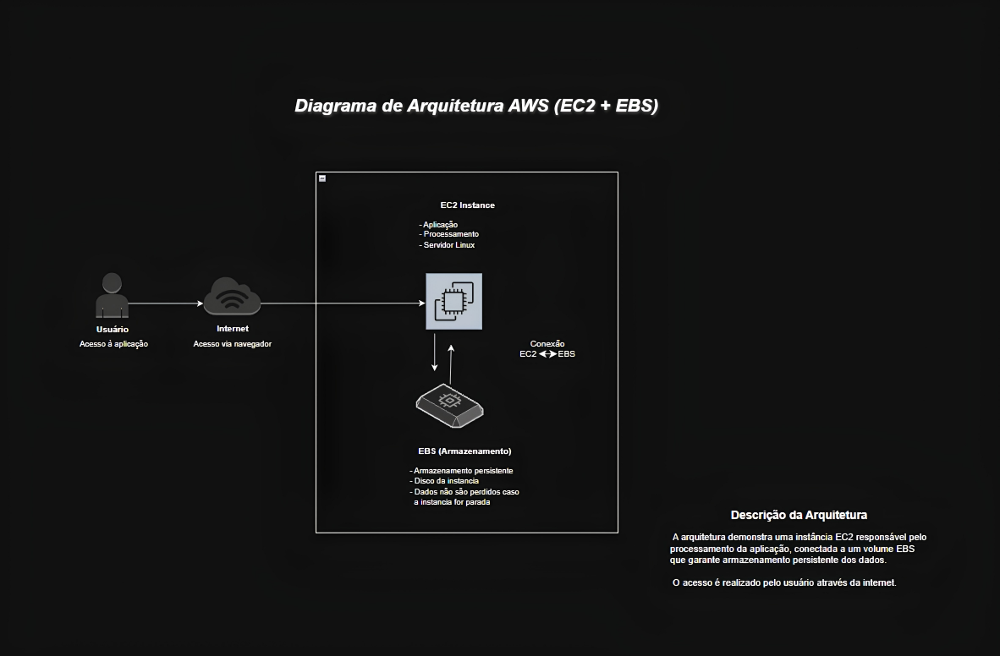

# ☁️ Arquitetura de Aplicação na AWS

##  Diagrama

---

##  Descrição

Este projeto apresenta um diagrama simples de arquitetura na AWS.

O usuário acessa a aplicação por meio da internet, que direciona a requisição para uma instância EC2.   A EC2 é responsável pelo processamento da aplicação e está conectada a um volume EBS, que garante o armazenamento persistente dos dados.

---

##  Componentes

- **EC2 (Elastic Compute Cloud):** responsável pelo processamento da aplicação  
- **EBS (Elastic Block Store):** armazenamento persistente dos dados  
- **Internet:** meio de acesso do usuário  

---

##  Objetivo

Demonstrar de forma prática e visual o funcionamento básico de uma arquitetura na AWS utilizando EC2 e EBS.

---
## Feito por

**Maria Luiza Collaço**
